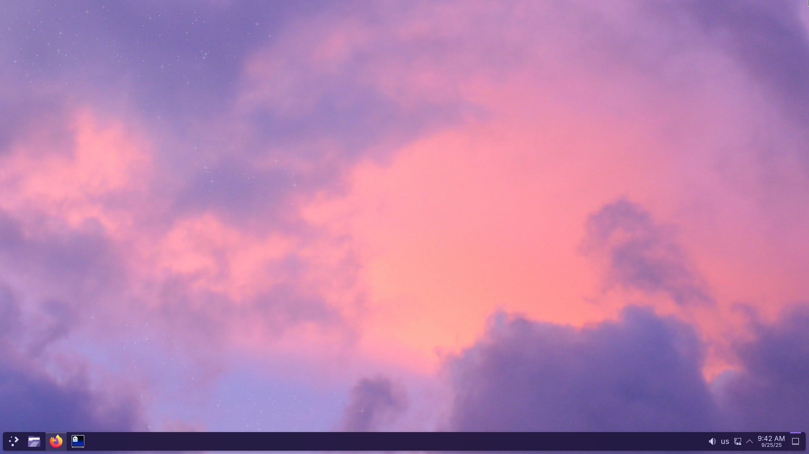
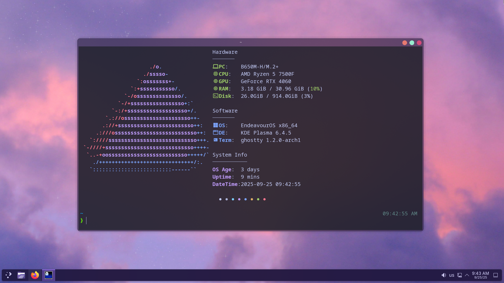
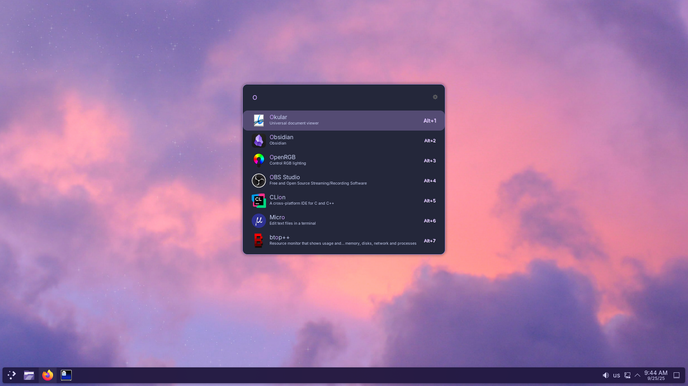
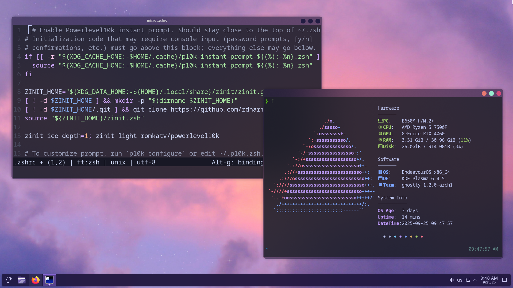
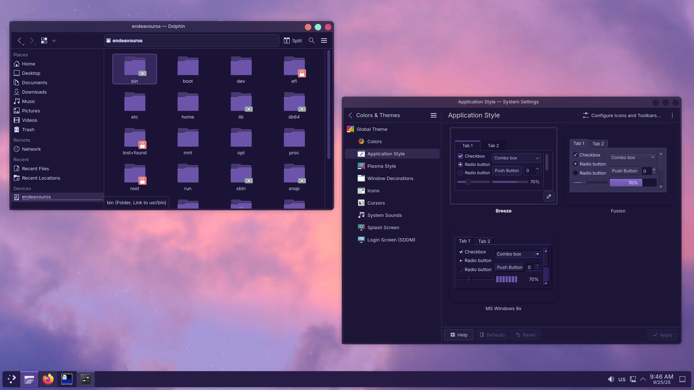

# dotfiles

This repository contains my personal dotfiles for arch-based [EndeavourOS](https://endeavouros.com/) with the [KDE Plasma](https://kde.org/plasma-desktop) desktop environment.

My goal was to create a fresh, ready-to-use setup by including as many KDE and application settings as possible. However, due to the personal nature of some configurations, you may still need to adjust a few things to perfectly suit your needs.

-----

<details>
  <summary><h2>Screenshots & Showcase</h2></summary>

  <p>If you'd like to see the configuration in action, here's a short video showcase:</p>

  <h2><a href="https://www.youtube.com/watch?v=9K6bgTDdoCE">Showcase</a></h2>

  <p>You can also check out some static screenshots below:</p>

  <div align="center">
    
    <br>
    <em>A clean and minimal desktop setup.</em>
  </div>
  <br>

  <div align="center">
    
    <br>
    <em>Terminal running Fastfetch, showcasing the color scheme and fonts.</em>
  </div>
  <br>

  <div align="center">
    
    <br>
    <em>The Ulauncher application launcher.</em>
  </div>
  <br>

  <div align="center">
    
    <br>
    <em>The Micro text editor.</em>
  </div>
  <br>

  <div align="center">
    
    <br>
    <em>Settings & Dolphin.</em>
  </div>

</details>

-----

### Requirements

Before proceeding, make sure you have the necessary packages and tools installed.

```sh
# Install core packages from official repositories
sudo pacman -S git stow ghostty fastfetch flameshot micro zsh wl-clipboard inter-font

# Install Ulauncher from the AUR
git clone https://aur.archlinux.org/ulauncher.git
cd ulauncher
makepkg -is
cd ..
```

  * **Change your default shell to Zsh:**
    ```sh
    chsh -s $(which zsh)
    ```

Reboot.

-----

### Installation

1.  **Clone the repository:**

    ```sh
    git clone https://github.com/dkorbelainen/dotfiles.git
    cd dotfiles
    ```

2.  **Use GNU Stow to create symlinks:**

    ```sh
    stow . --adopt
    ```

**Note on Stow:** The `--adopt` flag allows Stow to take control of existing configuration files and move them into this repository. It's an effective way to manage your current setup. However, in rare cases, if a file or directory is in the way, Stow may fail. If this happens, you will need to manually remove or rename the conflicting item (e.g., `mv ~/.config/conflicting_file ~/.config/conflicting_file.bak`) and re-run the `stow` command.

-----

### Structure

My dotfiles include configurations for the following applications:

  * **Zsh**: Shell configuration.
  * **Ghostty**: Terminal emulator.
  * **KDE Plasma**: Theme, panel, and window manager settings.
  * **Fastfetch**: System information utility.
  * **Flameshot**: Screenshot tool.
  * **Micro**: Terminal-based text editor.
  * **Ulauncher**: Application launcher.
  * **Wallpaper**: My wallpaper is included in the `assets/` directory.

### Notes

  * To use the wallpaper included in this repository, copy the image to your `~/Pictures` directory.
  * After running the `stow` command, you may need to **reboot** to see the changes.
  * I also like to set up other tools such as **WireGuard**, **Obsidian**, various **IDEs**, **Firefox**, **Spotify** with **Spicetify** and my **DAW** depending on my needs.

-----

### Additional KDE Configuration Guide

It is challenging to capture all KDE Plasma settings in a single place, as the desktop environment is not fully adapted for dotfile management. To achieve a complete setup, here are some additional manual configuration steps you may need to take.

- #### Appearance & Themes

    * **Wallpaper**: Set your desktop wallpaper manually to either an image from the repository or your own image.

    * **Colors** & **Application Style**:

        * In System Settings > Appearance > Colors, select the Sweet color scheme.

        * In Application Style, select Breeze. Adjust the transparency to approximately 50%.

        * In Plasma Style, select Breeze (or Sweet).

    * **Window Decorations**: Select Utterly-Round Dark and set the button size to Large.

    * **Icons** & **Cursors**: For a cohesive look, set both Icons and Cursors to Breeze Dark.

    * **Splash Screen**: I prefer to sett the splash screen to None.

    * **Login Screen**: Change the background image using the "Change Background" button.

- #### Fonts

    * In System Settings > Appearance > Fonts, set all fonts to **Inter** except for the Fixed-width font.

- #### Desktop Behavior & Effects

    * **Animations**: In System Settings > Workspace Behavior > Animations, set Peek at Desktop to None.

    * **Task Switcher**: I recommend downloading the custom task switcher Modern Informative and selecting it in System Settings > Workspace Behavior > Window Management > Task Switcher.

    * **Desktop Effects**:

        * Enable Background Contrast, Blur and Wobbly Windows.

        * Adjust Blur to approximately 100% Blur strength and 30% Noise strength.

    * **KWin Scripts**: Enable the Minimize All script.

- #### System Settings & Shortcuts

    * **Default Applications**: In System Settings > Applications, you may wish to set the default text editor to Micro and the default terminal to Ghostty.

    * **Autostart**: Manually add Flameshot and Ulauncher to the autostart list in System Settings > Startup and Shutdown > Autostart.

    * **Shortcuts**:

        * Remove default shortcuts for KRunner and Spectacle in System Settings > Shortcuts > Plasma. You can also remove the Spectacle application entirely.

        * Add custom shortcuts for Flameshot and Ulauncher. You can also set a dedicated shortcut for launching Ghostty.

- #### Panel Configuration

    * **Panel**: Change the panel opacity to **Translucent**.

    * **System Tray**: Go to the system tray's configuration and disable all unwanted entries.
      
    * **Minimize All Windows**: Go to the right corner > Show Alernatives > Minimize All Windows.
